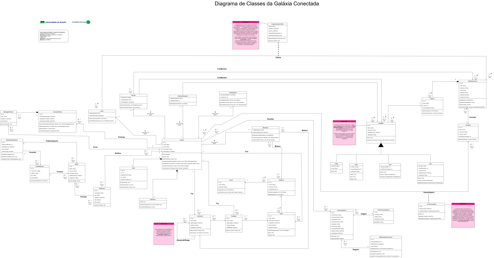

# Diagrama de Classes

## Sumário

- [Introdução](#Introdução)
- [Objetivos](#Objetivos)
- [Metodologia](#Metodologia)
- [Investigação das Classes Necessárias](#Investigação-das-Classes-Necessárias)
- [Os Tipos de Relacionamentos](#Os-Tipos-de-Relacionamentos)
- [Diagrama de Classes](#Diagrama-de-Classes)
- [Conclusão](#Conclusão)
- [Bibliografia](#Bibliografia)
- [Histórico de versão](#Histórico-de-versão)

## Introdução

Segundo o [artigo da plataforma UML Diagrams](https://www.uml-diagrams.org/class-diagrams-overview.html) [3](#ref3) e a Apostila UML – Linguagem de Modelagem Unificada [1](#ref1), uma classe pode ser definida como a descrição de um conjunto de objetos com os mesmos atributos, comportamentos e relacionamentos. Sendo assim, ela representa um conceito dentro do domínio do sistema. Já o Diagrama de Classes, um dos principais diagramas da modelagem estática da UML, é responsável por estruturar o sistema ao representar as suas classes, os atributos, os métodos (operações) e os relacionamentos entre elas, como herança, associação e agregação.

No projeto Galáxia Conectada, uma plataforma educacional voltada ao ensino de astronomia de forma acessível e interativa, o Diagrama de Classes será utilizado para modelar os principais elementos do sistema com o intuito de contribuir para a organização e para a compreensão da estrutura do software.

## Objetivos

O objetivo deste artefato é representar, de forma clara e estruturada, os componentes principais do sistema Galáxia Conectada por meio do Diagrama de Classes. Busca-se, com isso, garantir uma visualização precisa das entidades que compõem o sistema, suas responsabilidades e seus relacionamentos.

## Metodologia

O Diagrama de Classes será desenvolvido utilizando a ferramenta [Draw.io](https://app.diagrams.net/), a qual permite a criação de diagramas UML de forma prática e visual. 

Como base para a definição das classes, serão utilizadas as informações coletadas na [Entrega 01 do projeto](https://unbarqdsw2025-1-turma02.github.io/2025.1-T02-_G9_GalaxiaConectada_Entrega01/#/), a qual inclui:

- [Requisitos funcionais e não funcionais Elicitados](https://unbarqdsw2025-1-turma02.github.io/2025.1-T02-_G9_GalaxiaConectada_Entrega01/#/Base/IniciativaExtra/RequisitosElicitados);

- [Atores do sistema identificados no Rich Picture](https://unbarqdsw2025-1-turma02.github.io/2025.1-T02-_G9_GalaxiaConectada_Entrega01/#/Base/ArtefatoGeneralista/RichPicture);

- Informações organizadas por meio da metodologia [5W2H](https://unbarqdsw2025-1-turma02.github.io/2025.1-T02-_G9_GalaxiaConectada_Entrega01/#/Base/ArtefatoGeneralista/5W2H)

A partir dessa base, será feita uma investigação detalhada das entidades envolvidas no sistema. AEntão, serão definidas as classes do sistema, junto com seus atributos e métodos. Após compreender e definir bem as classes, serão analisados os relacionamentos de cada um delas. Por fim, o diagrama será elaborado e, em seguida, verificado de acordo com uma [tabela de verificação](Modelagem/IniciativasExtras/Verificacao/VerificacaoDiagramaClasses.md) baseada nos critérios sintáticos e semânticos da UML. Com isso, ajustes e melhorias serão aplicados conforme necessário.

## Investigação das Classes Necessárias

Antes de elaborar o diagrama diretamente no drawi.o, foi criada a tabela abaixo com base nas classes que seriam criadas ao se analisar os requisitos, os atores e as informações do 5W2H.

**Tabela 1:** Classes do Sistema.

| # | Classe   | O que é        | Atributos  | Métodos  |
|---|----------|----------------|------------|----------|
| 01 | **Usuario** | Conta de um indivíduo na plataforma, com dados básicos de login e perfil.                 | `- id: Int` `- nome: String` `- email: String` `- senhaHash: String`  `- dataCadastro: DateTime`                                                                                                                                                           | `login(): Boolean`, `logout(): Void`, `editarPerfil(dados: Map): Void`, `enviarMensagemPrivada(dest: Usuario, texto: String): MensagemPrivada`, `criarTopicoForum(subforum: Subforum, titulo: String, postInicial: String): Topico`, `postarEmTopico(topico: Topico, texto: String): Postagem`, `comentar(item: Comentavel, texto: String): Comentario`                                                 |
| 02 | **Aluno** | Dados específicos de um usuário como aluno.                                                | `- progressoGeral: Float` `- ultimoAcessoTrilha: DateTime`                                                                                                                                                                                                        | `listarCursosConcluidos(): List<Curso>`, `listarTrilhasEmAndamento(): List<TrilhaEducacional>`                                                                                                                                                                                                                                                                                                  |
| 03 | **Instrutor** | Dados específicos de um usuário como instrutor.                                            | `- biografiaCurta: String` `- avaliacaoMedia: Float` `- especialidades: List<String>`                                                                                                                                                                           | `listarTrilhasCriadas(): List<TrilhaEducacional>`, `listarConteudosCriados(): List<Conteudo>`                                                                                                                                                                                                                                                                                                      |
| 04 | **ProfessorVoluntario** | Dados de um usuário Professor Voluntário.                                                | `- areaEspecialidade: String` `- artigosRevisados: Int`                                                                                                                                                                                                             | `listarArtigosSubmetidos(): List<Artigo>`                                                                                                                                                                                                                                                                                                                                                     |
| 05 | **Administrador** | Dados e permissões de um usuário administrador.                                          | `- permissoesGlobais: List<String>` `- nivelAcesso: Int`                                                                                                                                                                                                            | `verLogSistema(filtro: String): List<LogEntry>`, `gerenciarUsuario(u: Usuario, acao: String): Boolean`, `gerenciarPromocao(p: Promocao, acao: String): Boolean`                                                                                                                                                                                                                              |
| 06 | **Moderador** | Dados e permissões de um usuário moderador do fórum.                                       | `- nivelModeracao: String` `- dataInicioModeracao: DateTime`                                                                                                                                                                                                     | `listarSubforumsModerados(): List<Subforum>`, `moderarPostagem(p: Postagem, acao: String): Boolean`, `moderarTopico(t: Topico, acao: String): Boolean`                                                                                                                                                                                                                                            |
| 07 | **Perfil** | Informações adicionais e de progressão do usuário.                                         | `- nivel: Int` `- xp: Int` `- linguagemPref: String` `+ avatarUrl: String`  **Observação**: Público para facilitar exibição direta da imagem em várias partes da UI.  `- bio: String`                                                                     | `atualizarNivel(): Void`, `adicionarXp(valor: Int): Void`, `atualizarAvatar(url: String): Void`                                                                                                                                                                                                                                                                                                 |
| 08 | **Reputacao** | Sistema de pontos e nível de reputação do usuário.                                         | `- pontos: Int`                                                                                                                                                                                                                                                      | `adicionarPontos(valor: Int, motivo: String): Void`, `calcularNivelReputacao(): String`                                                                                                                                                                                                                                                                                                        |
| 09 | **Notificacao** | Mensagens do sistema para o usuário.                                                     | `- id: Int` `- mensagem: String` `- tipo: String` `- dataEnvio: DateTime` `- lida: Boolean` `+ link: String`   **Observação:** Público para facilitar o uso do link de destino pela UI ao renderizar a notificação.                              | `marcarComoLida(): Void`                                                                                                                                                                                                                                                                                                                                                                           |
| 10 | **Conquista** | Prêmios, medalhas ou badges ganhos pelos usuários.                                         | `- id: Int` `+ titulo: String`   `` `+ descricao: String`   **Observação:** Público para exibição direta na UI.  `+ iconeUrl: String`  ` `- pontosXPConcedidos: Int`                                                                             | `desbloquearPara(u: Usuario): Boolean`                                                                                                                                                                                                                                                                                                                                                             |
| 11 | **TrilhaEducacional** | Conjunto de módulos educativos sobre um tema específico.                                   | `- id: Int` `+ titulo: String`     **Observação**: Público para exibição em listas e títulos.    `+ descricao: String`   **Observação:** Público para exibição em catálogos/detalhes.  `+ nivel: String`    ` `+ categoria: String`   ` `- publicada: Boolean` `+ imagemUrl: String` | `listarModulos(): List<Modulo>`, `calcularProgressoMedio(): Float`, `publicarTrilha(): Boolean`, `inscreverUsuario(u: Usuario): ProgressoUsuarioTrilha`                                                                                                                                                                                                                                  |
| 12 | **UsuarioConquista** | classe associativa que registra o evento e a data em que um Usuario específico ganhou uma determinada Conquista                                             | `- id: Int` `- dataConquista: DateTime`  ` - progressoOrigem: ProgressoUsuarioTrilha `  | `getId(): Int`, `getDataConquista(): DateTime`,   ` getProgressoOrigem(): ProgressoUsuarioTrilha`    |
| 13 | **Modulo** | Agrupamento de conteúdos dentro de uma trilha.                                             | `- id: Int` `+ titulo: String`   **Observação**: Público para exibição na estrutura da trilha.  `+ ordem: Int`   ` `+ descricaoBreve: String`                                                                                                      | `listarConteudos(): List<Conteudo>`, `adicionarConteudo(c: Conteudo): Boolean`                                                                                                                                                                                                                                                                                                                   |
| 14 | **Conteudo** (Abstrata) | **Observação:** Superclasse (abstrata) que representa um material de estudo genérico na plataforma. | `- id: Int` `+ titulo: String`   **Observação:** Público para exibição em listas/sumários.` `+ descricao: String`    `+ dataPublicacao: DateTime`     `- visibilidade: String`                                                                 | `exibir(): Void` (abstrato), `adicionarComentario(u: Usuario, texto: String): Comentario`                                                                                                                                                                                                                                                                                                           |
| 15 | **Artigo** | Subclasse de `Conteudo`; representa conteúdo textual.                                    | `- textoHtml: String` `+ fonte: String`   **Observação:** Público para exibição da fonte/referência.                                                                                                                                                         | `exibir(): Void`                                                                                                                                                                                                                                                                                                                                                                                   |
| 16 | **Video** | Subclasse de `Conteudo`; representa conteúdo audiovisual.                                  | `+ urlVideo: String`   **Observação:** Público para acesso direto pelo player de vídeo. `+ duracaoSegundos: Int` `- transcricao: String`                                                                                                                 | `exibir(): Void`, `play(): Void`, `pause(): Void`                                                                                                                                                                                                                                                                                                                                                 |
| 17 | **Quiz** | Subclasse de `Conteudo`; representa avaliação interativa de conhecimento.                  | `+ tempoLimiteMin: Int`   **Observação:** Público para exibir regras do quiz ao usuário.  `+ tentativasPermitidas: Int`                                                                                                                               | `exibir(): Void`, `iniciar(u: Usuario): TentativaQuiz`, `submeter(t: TentativaQuiz): ResultadoQuiz`                                                                                                                                                                                                                                                                                            |
| 18 | **Jogo** | Subclasse de `Conteudo`; representa jogo educativo.                                        | `+ tipoJogo: String`    `+ nivelDificuldade: Int`   ` `+ urlJogo: String`                                                                                                                                                                    | `exibir(): Void`, `iniciar(u: Usuario): SessaoJogo`, `registrarPontuacao(s: SessaoJogo): PontuacaoJogo`                                                                                                                                                                                                                                                                                       |
| 19 | **Forum** | O Fórum principal da plataforma.                                                         | `- id: Int` `+ nome: String`   **Observação:** Público para exibição do nome do fórum.  `+ descricao: String`                                                                                                                                              | `listarSubforums(): List<Subforum>`, `criarSubforum(nome: String, desc: String): Subforum`                                                                                                                                                                                                                                                                                                       |
| 20 | **Subforum** | Seção temática dentro do fórum.                                                          | `- id: Int` `+ nome: String`    `+ descricao: String`    `+ ordemExibicao: Int`   **Observação:** Público para ordenação na UI.                                                                                                                     | `listarTopicos(pagina: Int): List<Topico>`, `getModeradores(): List<Usuario>`                                                                                                                                                                                                                                                                                                                |
| 21 | **Topico** | Discussão iniciada em um subfórum.                                                       | `- id: Int` `+ titulo: String`   **Observação:** Público para exibição nas listas de tópicos.  `- dataCriacao: DateTime` `+ dataUltPost: DateTime`  `- fixado: Boolean` `- fechado: Boolean`                                                          | `listarPostagens(pagina: Int): List<Postagem>`, `fixar(): Void`, `fechar(): Void`                                                                                                                                                                                                                                                                                                              |
| 22 | **Postagem** | Contribuição de um usuário em um tópico.                                                   | `- id: Int` `+ texto: String`   **Observação:** Público, é o conteúdo principal da postagem para exibição.  `- dataPostagem: DateTime` `+ editado: Boolean`    `+ dataEdicao: DateTime?`   **Observação:** Público para exibir data da última edição na UI. | `editar(novoTexto: String): Void`                                                                                                                                                                                                                                                                                                                                                                  |
| 23 | **Comentario** | Comentário feito por um usuário (em Conteúdo, Postagem, etc.).                             | `- id: Int` `+ texto: String`    `- dataComentario: DateTime` `+ upvotes: Int`    `+ editado: Boolean`                                                                                                                                   | `editar(novoTexto: String): Void`, `responderA(c: Comentario): Comentario`                                                                                                                                                                                                                                                                                                                |
| 24 | **MensagemPrivada** | Mensagem trocada entre dois usuários.                                                    | `- id: Int` `- dataUltimaMensagem: DateTime` `- participante1LidaAte: DateTime` `- participante2LidaAte: DateTime`                                                                                                                                                                                 | `adicionarMensagem(remetente: Usuario, texto: String): MensagemPrivada`, `getMensagens(limite: Int, pagina: Int): Lista<MensagemPrivada>`, `getParticipantes(): Lista<Usuario>`, `getUltimaMensagem(): MensagemPrivada`                                                                                                                                                                                                                                                                                                                                                                           |
| 25 | **ConversaPrivada** | Mensagem trocada entre dois usuários.                                                    | `- id: Int` `- texto: String` `- dataEnvio: DateTime` `- lida: Boolean`                                                                                                                                                                                 | `marcarComoLida(): Void`                                                                                                                                                                                                                                                                                                                                                                           |
| 26 | **Noticia** | Item de notícia (externo ou interno).                                                    | `- id: Int` `+ titulo: String` `+ resumo: String`    `+ urlOriginal: String`   **Observação:** Público para link externo.  `+ dataPublicacao: DateTime`   `**Observação:** Público para exibição.` `+ imagemUrl: String`   **Observação:** Público para exibição da imagem. | `exibirCompleta(): String`                                                                                                                                                                                                                                                                                                                                                             |
| 27 | **FonteDeNoticias** | Provedor de notícias.                                                                    | `- id: Int` `+ nomeFonte: String`   `**Observação:** Público para exibir a origem da notícia.` `- urlBase: String` `- tipo: String` `- ativa: Boolean`                                                                                          | `buscarNovasNoticias(): List<Noticia>`                                                                                                                                                                                                                                                                                                                                                         |
| 28 | **PromocaoExterna** | Representa uma oferta especial encontrada em algum site, como Amazon ou Magazine Luiza.                                           | `- id: Int`  ` - nomeProduto: String ` ` - descricaoProduto: String ` ` - precoOriginal: Float ` ` - precoPromocional: Float ` ` - lojaOrigem: String ` ` + linkProduto: String ` ` + urlImagemProduto: String ` ` dataEncontrada: DateTime ` ` - dataValidade: DateTime`                                                                   | `irParaLoja(): Void`, `verificarValidade(): Boolean`     |
| 29 | **FontePromocaoExterna** | Representa um site de e-commerce monitorado em busca de promoções (ex: Amazon, Magazine Luiza).               | `- id: Int ` ` + nomeLoja: String ` ` - urlBase: String ` ` - seletorPreco: String `                                        | `+ getUrlBase(): String`           |
| 30 | **BotImportadorPromocoes** | Processo automatizado que busca promoções em sites externos e as registra na plataforma.                    | `- id: Int` `- frequenciaMinutos: Int` `- ultimaExecucao: DateTime` `- ativo: Boolean` ` sitesMonitorados: List<FontePromocaoExterna>`                                                                                                 | `executarBusca(): Void`, `agendarProximaBusca(): Void`, `registrarPromocao(dadosPromocao: Map): PromocaoExterna`   |
| 31 | **ProgressoUsuarioTrilha** | Rastreia o progresso de um usuário em uma trilha específica.                              | `- status: String` `- dataInicio: DateTime` `- dataFim: DateTime?` `- ultimoModuloAcessado: Int` `- percentualConclusao: Float`                                                                                                                     | `atualizarProgresso(m: Modulo): Void`, `marcarConcluido(): Void`                                                                                                                                                                                                                                                                                                                               |
| 32 | **BotImportadorNoticias** | Processo automatizado para buscar e importar notícias de fontes externas.                | `- id: Int` `- frequenciaMinutos: Int` `- ultimaExecucao: DateTime` `- ativo: Boolean` `- fontesConfig: List<Map>`                                                                                                                                   | `executarImportacao(): Void`, `agendarProximaExecucao(): Void`, `configurarFonte(f: FonteDeNoticias): Void`                                                                                                                                                                                                                                                                           |

<b> Autora: </b> <a href="https://github.com/SkywalkerSupreme">Larissa Stéfane</a>.

**Observação:** Inicialmente, tinha-se pensado em fazer o **usuário** como uma superclasse e **Aluno**, **Instrutor**, **Professor_Voluntário** e **Administrador** como suas subclasses. Contudo, percebeu-se que essa abordagem limita a representação de cenários reais onde uma única pessoa pode acumular múltiplas funções simultaneamente, como ser Instrutor e Professor_Voluntário ao mesmo tempo. **A herança estabelece uma relação "é um(a)", e assim força uma instância a pertencer a apenas uma das subclasses mais específicas, o que impede a combinação de papéis**. Por isso, optou-se por um modelo baseado em **composição: Usuario passa a ser uma classe comum**, representando a entidade central da pessoa ou conta no sistema, e ela se relaciona (agrega ou compõe) com outras classes que representam os diferentes Papéis (PapelAluno, PapelInstrutor, PapelProfessorVoluntario, PapelAdministrador). 
 

## Os Tipos de Relacionamentos

Com o objetivo de construir o diagrama da forma mais completa e mais correta possível, foi realizado um estudo por meio do artigo [Class Diagram | Unified Modeling Language (UML)](https://www.geeksforgeeks.org/unified-modeling-language-uml-class-diagrams/) [2](#ref2) sobre os tipos de relacionamentos necessários para o sistema da **Galáxia Conectada**. Esses relacionamentos descrevem como as classes interagem e se conectam entre si, cada um com seu próprio significado e nível de acoplamento.

### Os relacionamentos:

A tabela 1 mostra os Tipos de Relacionamentos que serão utilizados no diagrama de classes.

**Tabela 2:** Tipos de Relacionamentos

| Tipo de Relacionamento | O que é | Exemplo no Projeto | Símbolo | Observação/Extra |
|:-----------------------|:--------|:-------------------|:--------|:-----------------|
| Dependência | Representa uma ligação fraca e temporária entre classes. | O `BotImportador` depende da `IntegracaoExterna` para buscar dados, mas não mantém referência fixa. | Linha tracejada com seta. | Não será representado no diagrama para manter a legibilidade. |
| Associação | Representa um vínculo estruturado entre classes; uma classe conhece a outra e pode enviar mensagens. | A `WebUI` se associa ao `APICursos` para exibir cursos e módulos. | Linha contínua simples. | Pode indicar cardinalidade (ex: "um para muitos", "muitos para muitos"). |
| Agregação | Um tipo especial de associação ("parte-todo") com baixa rigidez; partes podem existir sem o todo. | Um `Curso` agrega vários `Módulos`; módulos podem existir mesmo se o curso for excluído. | Linha contínua com losango branco no "todo". | — |
| Composição | Relação forte de "parte-todo"; a parte não existe sem o todo. | Um `Quiz` é composto por várias `Questões`; se o quiz for apagado, as questões também desaparecem. | Linha contínua com losango preto no "todo". | — |
| Generalização | Representa uma relação "é-um"; herança de atributos e comportamentos. | `EventoAstronomico` como superclasse de `Eclipse` e `ChuvaDeMeteoros`. | Linha contínua com seta aberta (vazia) para a superclasse. | — |
| Realização | Representa a implementação de uma interface por uma classe concreta. | `ServicoNotificacoes` realiza (implementa) a interface `INotificacoes`. | Linha tracejada com seta aberta (vazia) para a interface. | — |

<b> Autora: </b> <a href="https://github.com/SkywalkerSupreme">Larissa Stéfane</a>.

### Conceitos Importantes

### Superclasse

- **Definição**: Uma superclasse é uma classe mais genérica que contém atributos e métodos comuns a várias outras classes.
- **Exemplo**: A classe **Conteúdo** pode ser a superclasse de **Artigo** e **Vídeo**, pois ambos compartilham características como `título`, `descrição` e `Data de publicação`.

### Subclasse

- **Definição**: Uma subclasse é uma classe mais específica que herda tudo da superclasse e pode adicionar seus próprios atributos e comportamentos.
- **Exemplo**: **Artigo** seria uma subclasse de **Conteúdo**.

### Os Relacionamentos no Diagrama de Classes

Com base na análise da tabela das classes e no significado e relevância dos relacionamentos, a tabela 3 mostra os relacionamentos de cada uma das classes da tabela 1.

| **Classe**      | **Relacionamentos**  | **Observações**    |
|-----------------|----------------------|--------------------|
| **Usuario** | • `Perfil` (1, **Composição**) • `Reputacao` (1, **Composição**) • `Aluno` (0..1, Associação "desempenha_papel?") • `Instrutor` (0..1, Associação "desempenha_papel?") • `ProfessorVoluntario` (0..1, Associação "desempenha_papel?") • `Administrador` (0..1, Associação "desempenha_papel?") • `Moderador` (0..1, Associação "desempenha_papel?") • `ConversaPrivada` (*, Associação "participa_em") • `MensagemPrivada` (*, Associação "enviou") • `Topico` (*, Associação "criou") • `Postagem` (*, Associação "criou") • `Comentario` (*, Associação "criou") • `Notificacao` (*, Associação "recebe") • `Conquista` (*, Associação "ganhou", via `UsuarioConquista`) • `TrilhaEducacional` (*, Associação "estuda", via `ProgressoUsuarioTrilha`) • `PontuacaoJogo` (*, Associação "possui") • `SessaoJogo` (*, Associação "jogou") | Classe central. Compõe `Perfil` e `Reputacao`. Associa-se opcionalmente (0..1) aos papéis. Participa de Conversas. Cria conteúdo no Fórum. Ganha Conquistas e progride em Trilhas (via Classes Associativas). Recebe Notificações. Envia Mensagens. |
| **Aluno** | • `Usuario` (1, Associação "pertence_a") • `Certificado` (*, Associação "recebeu" - *Classe Certificado não fornecida*) • `Curso` (*, Associação "realizou" - *Classe Curso não fornecida*) • `TrilhaEducacional` (*, Associação "está_em") | Representa papel. Ligado a 1 `Usuario`. Pode ter vários `Certificado`s (implícito). Relação com `TrilhaEducacional` e `Curso` (implícito). |
| **Instrutor** | • `Usuario` (1, Associação "pertence_a") • `TrilhaEducacional` (*, Associação "criou/mantém") • `Conteudo` (*, Associação "criou/mantém") | Representa papel. Ligado a 1 `Usuario`. Cria/mantém `TrilhaEducacional` e `Conteudo`. |
| **ProfessorVoluntario** | • `Usuario` (1, Associação "pertence_a") • `Artigo` (*, Associação "submeteu" - inferido) | Representa papel. Ligado a 1 `Usuario`. Interage com `Artigo`. |
| **Administrador** | • `Usuario` (1, Associação "pertence_a") • `LogEntry` (*, Dependência "<<consulta>>" - *Classe LogEntry não fornecida*) • `Usuario` (*, Dependência "<<gerencia>>") • `PromocaoExterna` (*, Dependência "<<gerencia>>") | Representa papel. Ligado a 1 `Usuario`. Métodos sugerem dependências para consulta e gerenciamento. |
| **Moderador** | • `Usuario` (1, Associação "pertence_a") • `Subforum` (*, Associação "modera") • `Postagem` (*, Dependência "<<modera>>") • `Topico` (*, Dependência "<<modera>>") | Representa papel. Ligado a 1 `Usuario`. Associa-se aos `Subforum`s que modera. Métodos sugerem dependência para moderar `Postagem` e `Topico`. |
| **Perfil** | • `Usuario` (1, **Composição** "pertence_a") | **Composição**: Componente direto do `Usuario`. |
| **Reputacao** | • `Usuario` (1, **Composição** "pertence_a") | **Composição**: Componente direto do `Usuario`. |
| **Notificacao** | • `Usuario` (1, Associação "destinada_a") • `BotNotificadorGeral` (1, Dependência "<<criada_por>>") | Ligada a 1 `Usuario`. Criada por `BotNotificadorGeral`. |
| **Conquista** | • `TrilhaEducacional` (1..*, Associação "concedida_por") • `Usuario` (*, Associação "ganha_por", via `UsuarioConquista`) | Define um prêmio. Concedida por Trilhas. Relação M:N com `Usuario` detalhada por `UsuarioConquista`. |
| **Comentario** | • `Postagem` (1, Associação "responde") • `Usuario` (1, Associação "criou") | Comentário responde a uma `Postagem` e é criado por um `Usuario`. |
| **Postagem** | • `Topico` (1, Associação "está_em") • `Usuario` (1, Associação "criou") • `Comentario` (*, Associação "possui") | Postagem está dentro de um Tópico. Pode ter vários Comentários. |
| **Topico** | • `Subforum` (1, Associação "pertence_a") • `Usuario` (1, Associação "criou") • `Postagem` (*, Associação "compõe") | Tópico pertence a um Subfórum e é composto por Postagens. |
| **Subforum** | • `Moderador` (*, Associação "moderado_por") • `Topico` (*, Associação "possui") | Subfórum agrupa Tópicos e é moderado por Moderadores. |
| **MensagemPrivada** | • `Usuario` (1, Associação "enviada_por") • `Usuario` (1, Associação "recebida_por") • `ConversaPrivada` (1, Associação "faz_parte_de") | Pertence a uma Conversa Privada. Tem remetente e destinatário. |
| **ConversaPrivada** | • `Usuario` (2, Associação "envolve") • `MensagemPrivada` (*, Associação "composta_por") | Conversa entre dois usuários, composta por mensagens. |
| **TrilhaEducacional** | • `Instrutor` (1..*, Associação "criada_por") • `Conteudo` (*, Associação "composta_por") • `Conquista` (*, Associação "concede") • `ProgressoUsuarioTrilha` (*, Associação "registra_progresso") | Trilha contém Conteúdos e concede Conquistas. Progresso é rastreado. |
| **Conteudo** | • `Instrutor` (1, Associação "criado_por") • `TrilhaEducacional` (1..*, Associação "pertence_a") | Criado por Instrutor e pode pertencer a várias Trilhas. |
| **ProgressoUsuarioTrilha** | • `Usuario` (1, Associação "progresso_de") • `TrilhaEducacional` (1, Associação "referente_a") | Classe associativa que registra o progresso do usuário. |
| **UsuarioConquista** | • `Usuario` (1, Associação "ganhou") • `Conquista` (1, Associação "foi_ganha") | Classe associativa entre `Usuario` e `Conquista`. |
| **BotNotificadorGeral** | • `Notificacao` (*, Dependência "<<envia>>") | Gera notificações para os usuários. |
| **SessaoJogo** | • `Usuario` (1, Associação "jogador") • `PontuacaoJogo` (1, Associação "gera") | Sessão de jogo pertencente a um usuário e gera uma pontuação. |
| **PontuacaoJogo** | • `SessaoJogo` (1, Associação "registrada_por") • `Usuario` (1, Associação "pertence_a") | Pontuação registrada em uma Sessão e ligada a um Usuário. |

<b> Autora: </b> <a href="https://github.com/SkywalkerSupreme">Larissa Stéfane</a>.

## Diagrama de Classes 

Abaixo, há o Diagrama de Classes criado:

**Observação:** Para analisaro Diagrama de Classes de forma ampliada e em seus detalhes, clique na imagem e ela será aberta em uma nova aba, a qual lhe permitirá explorá-lo com um zoom.

    Figura 1: o Diagrama de Classes
     
    
     
    <b>Autora:</b> <a href="https://github.com/SkywalkerSupreme">Larissa Stéfane</a>.
     

**Observação:** Caso deseje visualizar ou baixar em PDF, clique na mensagem abaixo e o pdf será mostrado. Para baixá-lo, basta clicar nele.

  
<b> Ver em PDF e baixá-lo </b>
 

<b> Autora: </b> <a href="https://github.com/SkywalkerSupreme">Larissa Stéfane</a>.

## Conclusão

A elaboração do Diagrama de Classes para o projeto Galáxia Conectada possibilitou a representação estruturada das principais entidades do sistema e suas interações.

## Bibliografia

  
[1] APOSTILA UML. Seção sobre representação de classes. Disponibilizada pela professora. Acesso em: 25 abr. 2025.

  
[2]GEEKSFORGEEKS. Unified Modeling Language (UML) Class Diagrams. Disponível em: https://www.geeksforgeeks.org/unified-modeling-language-uml-class-diagrams/. Acesso em: 25 abr. 2025.

  
[3]Lucid Software Português. Tutorial de Diagramas de Classes UML. Disponível em: https://www.youtube.com/watch?v=rDidOn6KN9k. Acesso em: 26 abr. 2025.

  
[4] UML DIAGRAMS. Class Diagrams Overview. Disponível em: https://www.uml-diagrams.org/class-diagrams-overview.html. Acesso em: 25 abr. 2025.

## Histórico de versão

| Versão | Alteração | Responsável | Data |
| - | - | - | - |
| 1.0 | Elaboração do documento| Larissa Stéfane | 25/04/2024 |
| 1.1 | Adição da Metodologia  | Larissa Stéfane | 25/04/2024 |
| 1.2 | Criação da tabela de investigação das classes | Larissa Stéfane | 25/04/2024 |
| 1.3 | Adição de mais elementos na  tabela de investigação das classes | Larissa Stéfane | 26/04/2024 |
| 1.4 | Adição da análise dos tipos de relacionamentos | Larissa Stéfane | 26/04/2024 |
| 1.5 | Adição de mais elementos na  tabela de investigação das classes | Larissa Stéfane | 26/04/2024 |
| 1.6 | Reorganização das super e subclasses | Larissa Stéfane | 26/04/2024 |
| 1.7 | Adição da Tabela de Relacionamentos | Larissa Stéfane | 26/04/2024 |
| 1.8 | Adição do Diagrama de Classes| Larissa Stéfane | 27/04/2024 |
